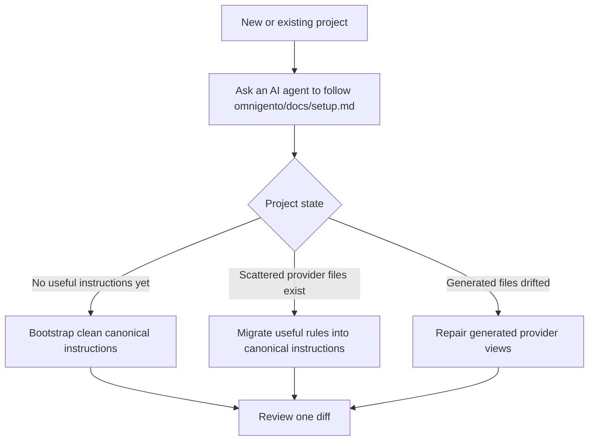
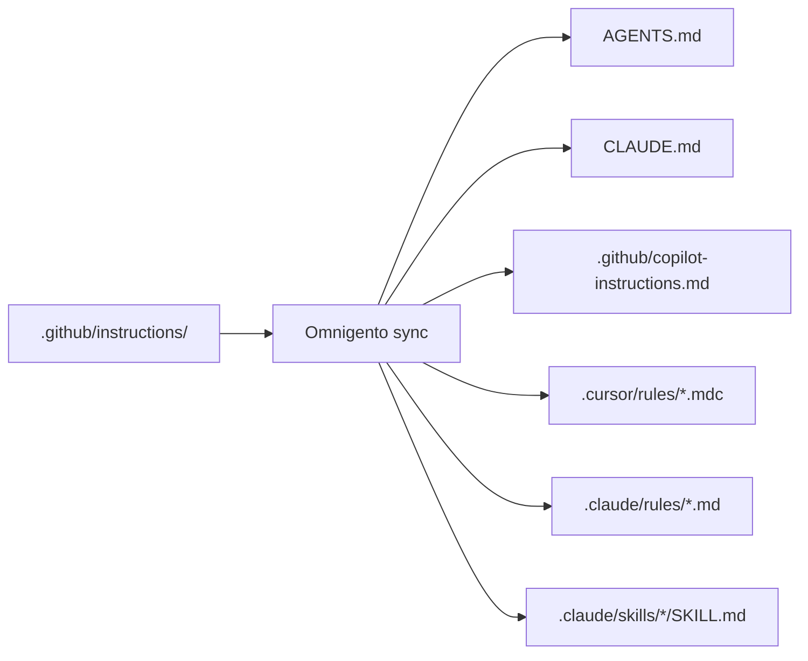
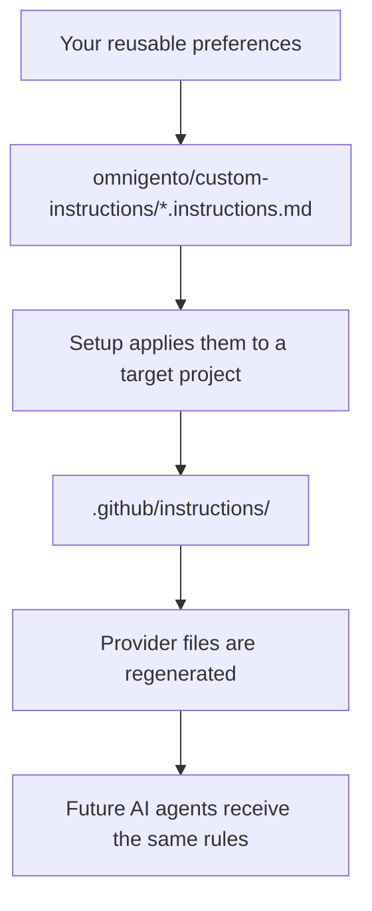

# Omnigento

Omnigento is a setup kit for keeping AI coding-agent instructions consistent across tools.

For a new project, Omnigento helps an AI agent create a clean instruction system from the start.

For an existing project, Omnigento helps an AI agent migrate scattered Cursor, Claude, Copilot, Codex, `AGENTS.md`, or older agent-tool instructions into one canonical instruction system.

In both cases, it keeps every provider view in sync after setup.

The user workflow is intentionally simple:

```text
Read and follow omnigento/docs/setup.md.
```

You give that instruction to a filesystem-capable coding agent. The agent reads the project, runs the Omnigento scripts, creates or migrates the canonical instruction files, regenerates the provider-specific files, and verifies consistency.

You review the diff. You do not manually copy rules between five different AI tools.



## What Problem It Solves

AI coding tools all want their own instruction format:

- GitHub Copilot uses `.github/copilot-instructions.md`
- Cursor uses `.cursor/rules/*.mdc`
- Claude Code uses `CLAUDE.md`, `.claude/rules/*.md`, and `.claude/skills/*/SKILL.md`
- Codex and other tools read `AGENTS.md`
- Older setups may have `.cursorrules`, `GEMINI.md`, `.windsurfrules`, `.clinerules`, `.roo/rules/**`, or `.cody/**`

New projects need clear rules before agents start improvising. Existing projects often already have rules scattered across provider-specific files.

Without a system, the same project rule gets copied everywhere. Then one copy changes, another does not, and your agents start receiving contradictory instructions.

Omnigento handles both cases:

- **New project:** create a canonical instruction structure and generate provider views from day one.
- **Existing project:** migrate useful rules out of old provider files, normalize them, and regenerate clean provider views.

Omnigento fixes that by making `.github/instructions/` the canonical source of truth.

```text
.github/instructions/*.instructions.md        canonical project rules
.github/instructions/skills/*.instructions.md canonical on-request workflows
```

Everything else becomes generated:

```text
AGENTS.md
CLAUDE.md
.github/copilot-instructions.md
.cursor/rules/*.mdc
.claude/rules/*.md
.claude/skills/*/SKILL.md
```

The provider files are no longer hand-maintained. They are regenerated from the canonical `.github/instructions/` folder.



## What Happens When You Use It

Omnigento helps your AI agent:

1. Find existing AI instruction files.
2. Decide whether the project needs a fresh setup, a migration, or a repair.
3. For a new project, create the initial canonical instruction structure.
4. For an existing project, extract useful project rules from old provider-specific files.
5. Remove provider boilerplate and stale source-of-truth claims.
6. Create or update canonical `.github/instructions/*.instructions.md` files.
7. Add the Omnigento instruction rules that teach future agents how to maintain the system.
8. Regenerate Copilot, Cursor, Claude, Codex, and `AGENTS.md` views from the canonical files.
9. Run checks so generated files cannot silently drift.

That is the main value: Omnigento gives new projects a clean instruction system and gives existing projects a path out of provider-file sprawl.

## After Setup

After Omnigento is installed, future instruction changes should happen in `.github/instructions/`.

Omnigento also adds instructions for future instruction maintenance. That means when you later ask an AI agent to add or change project instructions, the agent should know to update the canonical `.github/instructions/` files first and then run the Omnigento sync script so every provider view is regenerated.

That means the human workflow is:

```text
"Add instructions for how this repo handles deployments."
```

The agent workflow is:

```text
edit .github/instructions/...
run ./omnigento/bin/sync_ai_instructions.py --write
run ./omnigento/bin/sync_ai_instructions.py --check
```

If you edit instruction files manually, you need to run the sync yourself:

```bash
./omnigento/bin/sync_ai_instructions.py --write
./omnigento/bin/sync_ai_instructions.py --check
```

The important part for the user is that AI-assisted instruction changes can stay consistent automatically because Omnigento plants the maintenance rules and provides the sync script. You do not need to remember how Cursor, Claude, Copilot, and `AGENTS.md` each want the same rule formatted.

## Install

Add Omnigento to your project:

```bash
git submodule add https://github.com/rugovitGejming/omnigento.git omnigento
```

Then ask your coding agent:

```text
Read and follow omnigento/docs/setup.md.
```

The setup file is the playbook. It tells the agent when to bootstrap a new project, when to normalize existing instructions, and when to repair generated drift.

## What Omnigento Adds To Your Project

Omnigento plants and maintains a canonical instruction structure:

```text
.github/instructions/
  instruction-style.instructions.md
  omnigento.instructions.md
  ...
  skills/
    <workflow>.instructions.md
```

If `omnigento/custom-instructions/` exists, setup also applies those user-owned templates. That folder is for personal or company preferences that are useful across projects but should not be treated as Omnigento defaults.



The `omnigento.instructions.md` and `instruction-style.instructions.md` files are especially important. They teach future agents that:

- canonical instructions live in `.github/instructions/`
- generated provider files should not be edited by hand
- new instructions should be added to the canonical layer first
- provider views should be regenerated from canonical files
- drift checks should be run before finishing
- manual instruction edits require manually running the sync/check commands

This is what makes the setup durable instead of a one-time migration.

## For Maintainers

Most users should interact with Omnigento through their AI agent. The scripts exist so the agent has deterministic tools instead of improvising.

Core scripts:

| Script | What it is for |
|---|---|
| `bin/plant.py` | Adds Omnigento baseline files and missing provider entry points. |
| `bin/normalize_legacy_instructions.py` | Inventories and migrates existing provider-specific instruction files into canonical files. |
| `bin/sync_ai_instructions.py --write` | Regenerates provider files from `.github/instructions/`. |
| `bin/sync_ai_instructions.py --check` | Fails if generated provider files drift from canonical output. |
| `bin/sync_ai_instructions.py --audit` | Finds broken generated surfaces, orphan rules, dangling links, and scaffold residue. |

## Verification

Omnigento has a zero-dependency regression suite:

```bash
python3 tests/run_normalizer_regression.py
```

The tests use temporary projects and do not modify real project instruction files.

## Status

Omnigento is intentionally file-based. It does not require a service, database, editor plugin, or hosted account. It is meant to make AI instruction systems reviewable, portable, and consistent across tools.

See [docs/README.md](docs/README.md) for the detailed technical reference.
